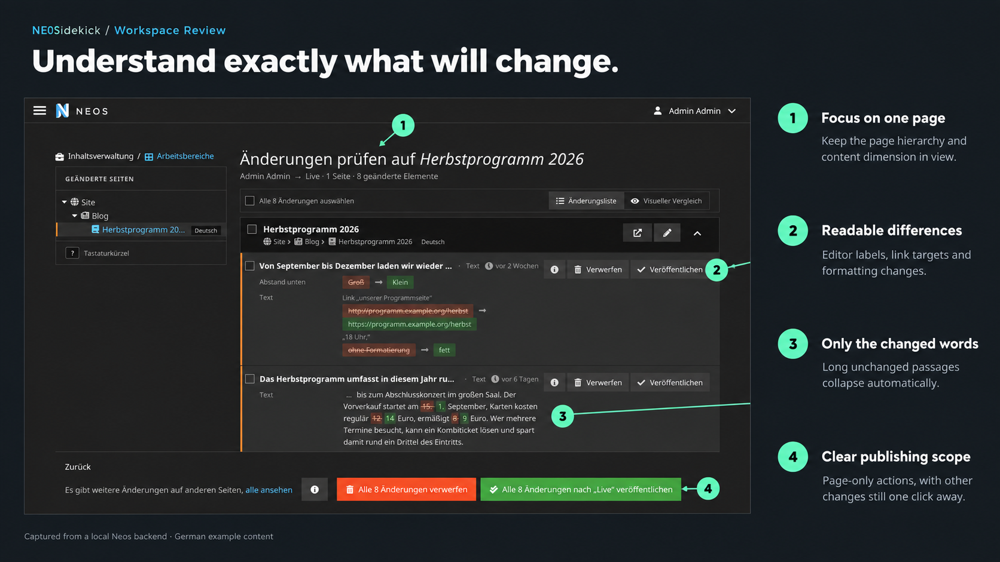
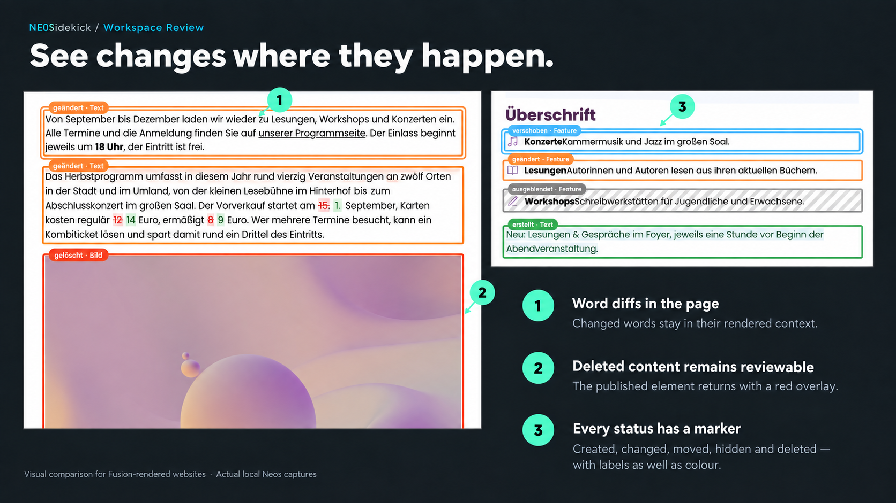
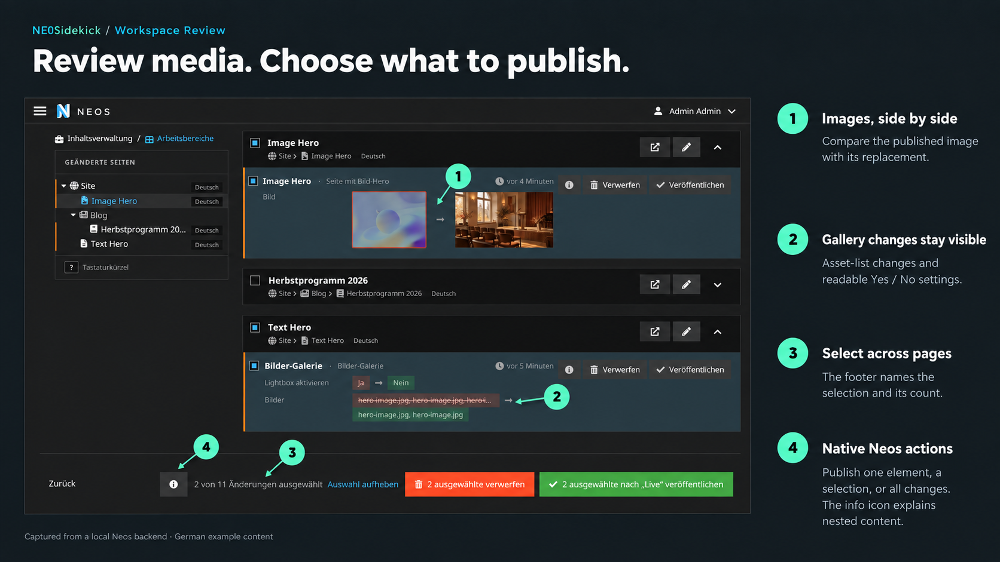
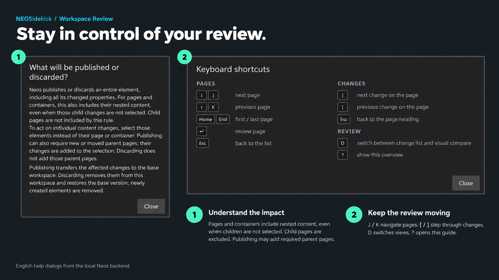

# NEOSidekick.WorkspaceReview

**Understand exactly what will change before publishing a Neos workspace.**

The package replaces the review view of the Neos backend module *Management → Workspaces* with a React application: a page tree of the changed pages, one card per changed element with word-level text diffs, keyboard review, a visual compare of the rendered page and a review narrowed to a single page. Publishing, discarding and the module path keep their existing behavior. Reviewing and previewing private workspaces requires backend access and permission to read or manage the workspace.

As AI agents like [NEOSidekick v3](https://neosidekick.com/) change content, having a review that shows all changes becomes essential.

## Preview









## Installation

```bash
composer require neosidekick/workspace-review
./flow flow:cache:flush
./flow session:destroyall
```

## Improvements at a glance

- **See changes on the page.** A view switch shows either the change list or a visual compare: the page rendered as it will look, with created, changed, moved, hidden and deleted elements marked in place and the changed words highlighted in the text. Deleted elements are taken from the published page and shown with a red overlay.
- **Review from the keyboard.** J/K move between pages, [ / ] step through changes and D switches views. **?** opens the shortcut overview.
- **Jump between changed pages.** A sticky left sidebar lists the changed pages as a tree styled like the backend page tree, with their content dimension. The current page stays highlighted as you scroll, and each page is a separate block in the review.
- **Read changes in page order.** Within each page, cards follow the content tree's order, with containers before their children. Each card explains the individual change directly.
- **Configurations become visible.** Select boxes, toggles and references use translated editor labels instead of raw stored values.
- **Word-level diffs reduce noise.** Reviewers see the changed words instead of comparing two complete paragraphs. Long unchanged passages collapse to an ellipsis. Deleted words are struck through, so the diff does not rely on colour alone.
- **Status and position are instantly clear.** Created, deleted, moved and hidden elements receive explicit badges. Positions use readable sibling numbers instead of sorting indexes.
- **Three ways to publish, each stated.** Publish or discard a single element with the labelled buttons on its card, select several changes for the batch buttons, or act on everything. The footer stays in view and says what its buttons act on: the selection with its count, or all changes when nothing is selected.
- **Review and publish a single page.** A link with the page's node narrows the review to that page: only its changes are listed, the heading names it, and the batch buttons publish or discard only them. The footer says when other pages have changes too and links to the whole workspace. See [Review a single page](#review-a-single-page).
- **Every change has an explanation.** Visibility changes, reverted edits and internal updates no longer produce unexplained empty rows.
- **Links and formatting become visible.** Retargeted links, window behavior, linked text and formatting changes are detected even when the wording remains unchanged.
- **Zebra Support** Works with Zebra for nextjs. Visual comparison requires a Fusion-rendered frontend, so the visual compare is automatically hidden.

[Documentation/Technical-Documentation.md](Documentation/Technical-Documentation.md)
